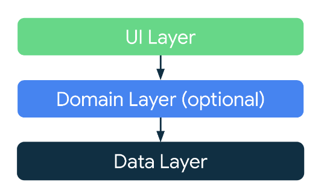
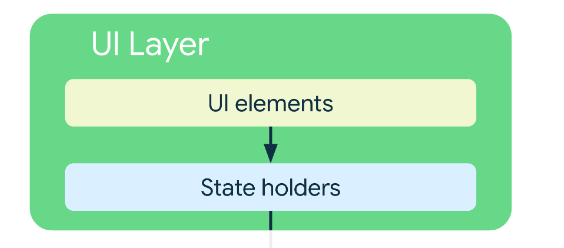
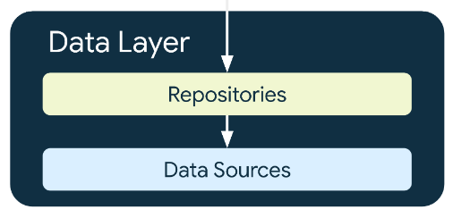
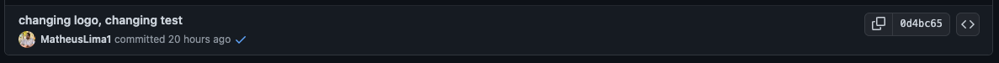
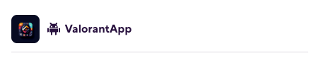
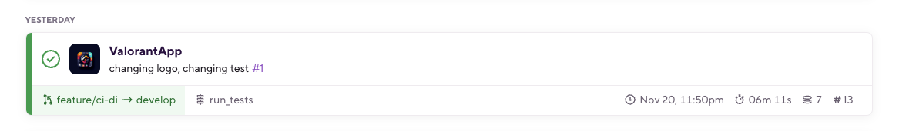
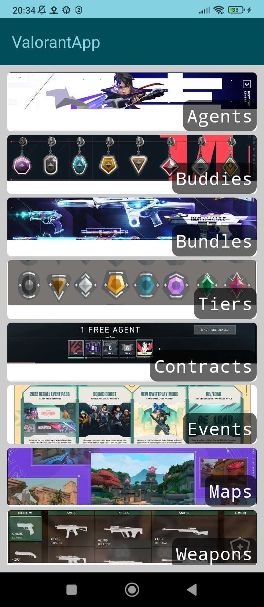
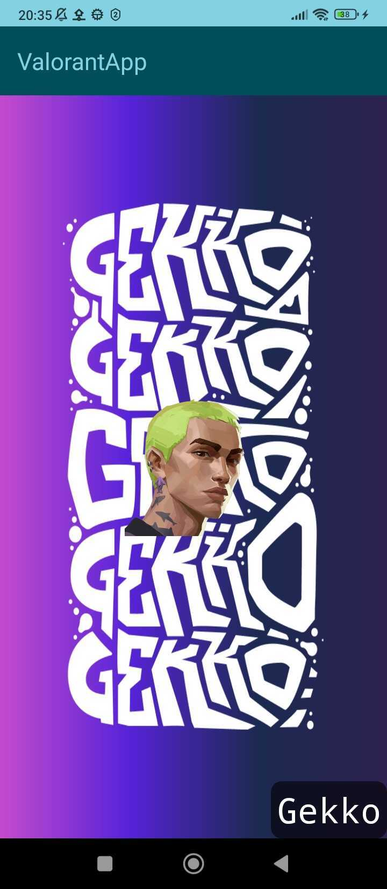

# ValorantApp
Valorant app where is possible to get some info about Valorant in general

## Tech Stack

- Multi Module project
- Kotlin
- Clean Architecture
- Compose
- Coroutines / Flow
- MVVM
- Konsist
- Retrofit
- Gson
- Lottie Animations
- Junit
- Bitrise (CI)

## Architecture Overview:
This project is using the architecture as follows:

  

<b>Note: Until this current moment it wasn't required to create the domain layer, once it wasn't identified some use case that could be reusable in the app, so If the domain layer had been created, it would only increase the complexity and the boilerplate of the project.</b>

### UI Layer
The UI layer is responsible for giving feedback to the user interactions, it is also the presentation layer for the user. 
  The UI elements are been created using the Jetpack Compose Library.
  The State holders are been controlled under the ViewModel, and the ViewModel is responsible for updating the state of the UI (using coroutines/flow/state, etc..)

  

### Data Layer
The Data layer is responsible for create, storing and also providing the data to be shown to the user.
  The Repository classes are responsible for managing the correct data sources to get the data from different sources like Apis or Local Queries in the local database.
  Currently, in the project, we're doing some REST requests to the Valo API (https://valorant-api.com/) to get the information that will be shown to the user. This request is being made using some third-party libraries such as OKHTTP and Retrofit, also the conversion of the JSON to the entities in the project is been made by Gson.
  The DataSources classes represent how to get the data (from web/local data sources)
  <b> Note: the idea is to have two data sources in the feature one for the local database and another for the remote database </b>

  

## Gitflow
This project have three important branches:
- Master (contains the stable code)
- Release (contains the code that pretend to be stable)
- Develop (contains the development code)

### Process to create a feature:
First, it's needed checkout the develop branch, update it, and then create a feature branch following the convention: feature/[NAME-OF-THE-FEATURE], when the work in the branch is done, a new PR needs to be opened, a trigger in the bitrise will be called so the checkings will starts, the pipeline will check the code conventions, architecture patterns (using Konsist [https://docs.konsist.lemonappdev.com/getting-started/readme] to ensure it), run the tests, build the app, and then finishes, after validating all the checkings, the PR can be merged.

  

    
  

  

    
  

  

    
  

### Process to create a fix:
It's similar to the process to create a feature, instead of using a feature use a fix.

### Process to create a hotfix:
To fix a bug present the master, first, you need to check the master branch, then create a branch with the pattern: hotfix/[BUG-TO-FIX], when finished with the fix, open a PR directly for the master, and after the checkings success status, you can merge on master, after it, open a PR from master to develop and release branch.

## Continuous Integration

For Continuous Integration, this app is using Bitrise (https://bitrise.io/)

## Overview of the app:

<table>
  <tr>
    <td></td>
    <td></td>
  </tr> 
</table>
